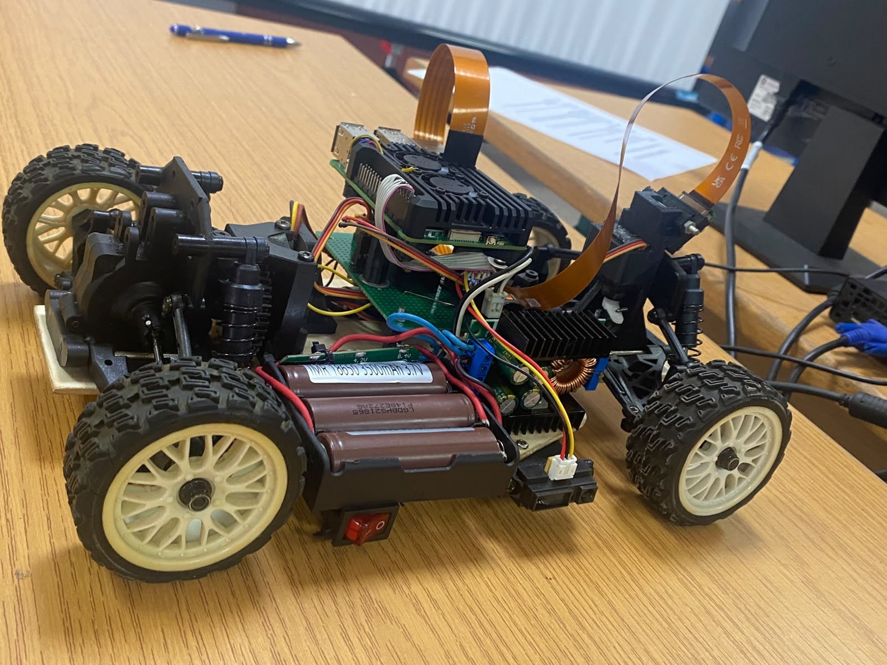

# InnoBots - WRO 2025 Future Engineers

## Team Members

### Saad Hantar
Team Leader & Technical Lead

### Hayat Oumlil
Communication Manager

### Ziad El Yafi
Innovation & Design Lead

## About Our Robot

Our robot is an autonomous vehicle designed for the WRO 2025 Future Engineers competition.

## Repository Structure

- t-photos
- v-photos
- videos
- schemes
- src
- models
- docs

## Robot

## Team

## 📚 Documentation

📄 [System Overview](docs/system-overview.md)

📄 [Hardware Components](docs/hardware.md)

📄 [Software Architecture](docs/software.md)

## 🚗 Vehicle

📸 [Vehicle Photos](v-photos/)

📈 [Vehicle Evolution](v-photos/evolution.md)

## 👥 Team

📸 [Team Photos](t-photos/)
